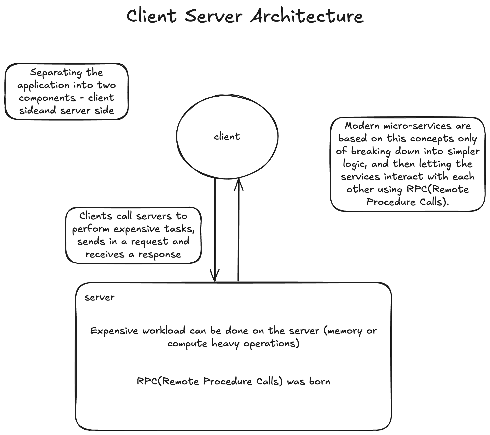

# client-server-architecuture

* Machines are expensive, applications are complex
	* Modern micro-services are based on this concepts only of breaking down into simpler logic, and then letting the services interact with each other using RPC(Remote Procedure Calls).
* Separating the application into two components.
* Expensive workload can be done on the server
* Clients call servers to perform expensive tasks
* RPC was born

## benefits 

* Servers need powerful hardware
* Clients have commodity hardware
* Clients can perform lightweight tasks.
* Clients no longer require dependencies
* However, we need a communication model 