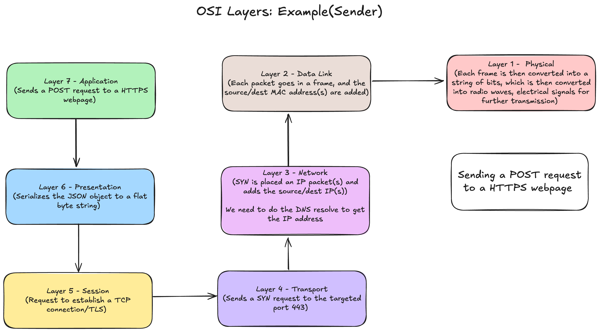
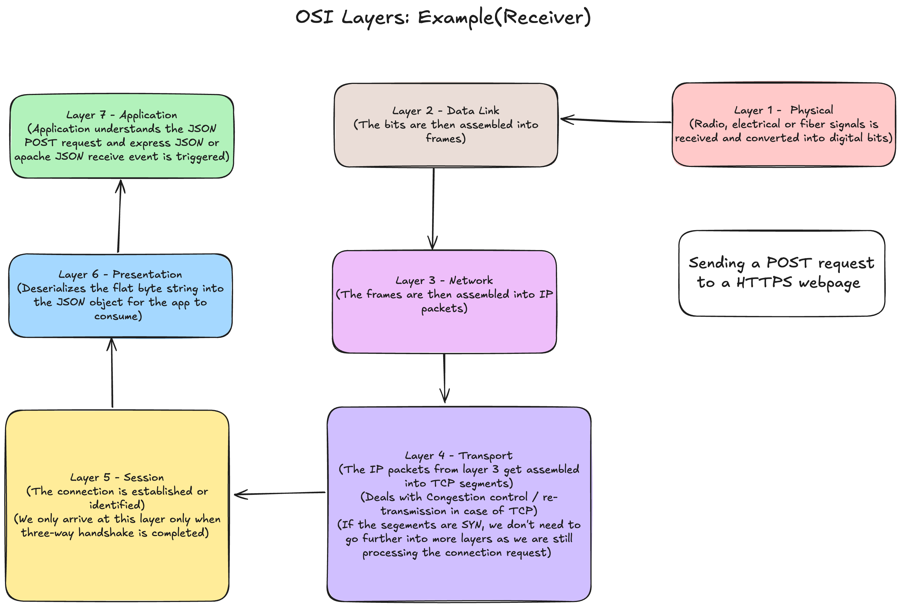
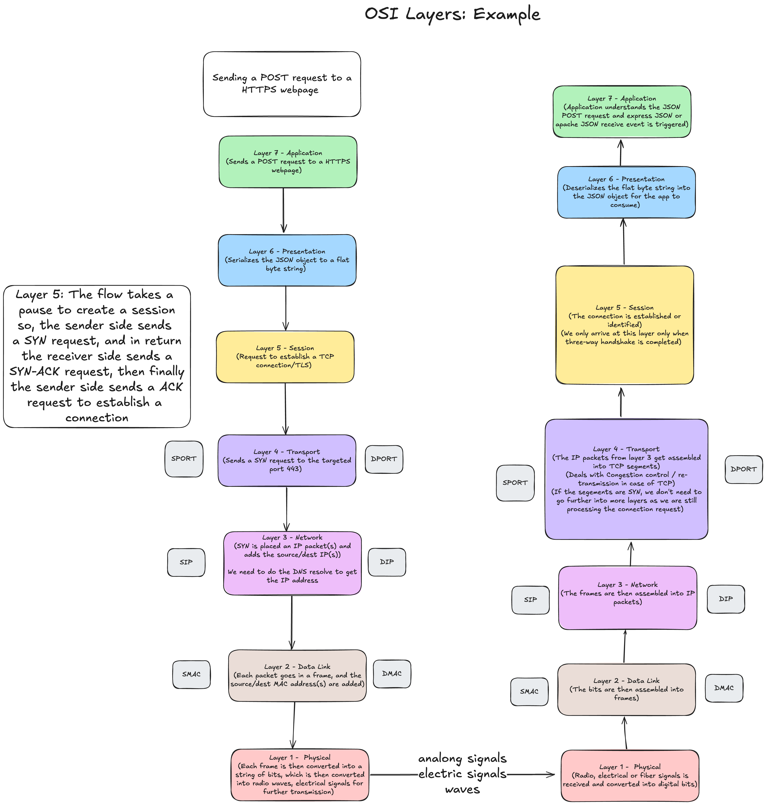
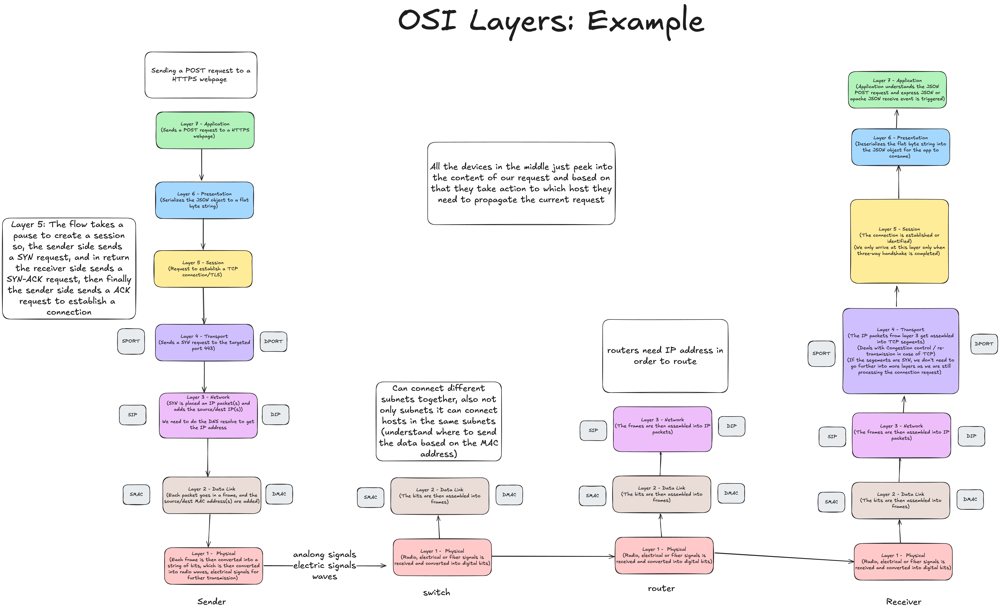

# osi model

OSI Model -> Open Systems Interconnection Model
## why do we need a communication model?

* Agnostic applications
	* Goal: Creating agnostic applications
	* Without a standard model, your application must have knowledge of the underlying networking medium
	* Imagine if we have to author different versions of our apps so that it works on WiFi vs Ethernet vs LTE vs Fiber
	* Example: Building a node.js application, which runs on any CPU(amd, arm), so the underlying architecture of node, allows it to compile on any type of CPU
	* So, we don't need to care if we are sending request from our application through cloud, which is going through a satellite, and then reaching its target via their LTE or WiFi -> Standardization 
* Network equipment management
	* Without a standard model, upgrading networking equipments becomes difficult 
* Decoupled Innovation
	* Innovations can be done in each layer separately without affecting the rest of the methods

## what is the osi model?

7 layers -> each describing a specific networking component

For backend engineers : Layer 4 and 7 (critical)
For DevOps engineers: Layer 4, Layer 7 and maybe a bit of Layer 2 and Layer 3
### layers

* Layer 7 - Application : HTTP / FTP / gRPC
	* Our application usually sits above these protocols.
* Layer 6 - Presentation : Encoding, Serialization
	* Example: Sending a JSON
		* JSON object needs to be serialized to a string(encoding + serialization) say UTF-8 encoding.
* Layer 5 - Session : Connection establishment, TLS
	* In this layer, setting up the state usually takes place, like storing the state in the client(Not storing on the server).
	* Stateful and Stateless protocol
		* HTTP -> Doesn't have a session layer (Stateless protocol)
		* TCP -> Stores a state on the server and a state on the client and we manage a session(Stateful). And if this session is destroyed effectively, either we can restart that connection or invalidate it . 
		* Session layer effectively checks it.
* Layer 4 - Transport : UDP(Datagram) / TCP (Segments)
	* Majorly only two protocols reside in the layer (QUIC is a new protocol -> Quick UDP Internet Connections, built on top of UDP)
	* Most protocols: HTTP/1, HTTP/2 -> TCP
	* We have visibility to port(:80, :443....)
* Layer 3 - Network : IP (Packets)
	* Network layer protocol, which is not concerned whether the packet is received or not.
	* We can directly built applications on top of layer 3. We only know address(IP address) of the target machines
	* Routing
* Layer 2 - Data Link - Frames, Mac addr, Ethernet
	* Physical medium, Physical addresses
	* Example: Sending a frame to a particular WiFi with a X MAC address
	* Protocols: Ethernet, WiFi 802
* Layer 1 - Physical - Electric signals, fiber or radio waves
	* Bare metal
	* Electric signals
	* Electric signal -> Digital, then is converted into a frame

## example for osi layers: sender

## example for osi layers: receiver

## clients sends  an HTTPS POST request

## across networks

## across networks - advanced

## shortcomings of osi model

* OSI model has too many layers which can be hard to comprehend
* Hard to argue about which layer does what?
* Simpler to deal with layers:5, 6 and 7 as just one layer, application (TCP/IP model)
  
## tcp / ip model

* Simpler than OSI model(just 4 layers)
* Application (Layers: 5, 6 and 7)
* Transport (Layer 4)
* Internet (Layer 3)
* Data link (Layer 2)
* Physical layer (not officially covered in the model)

