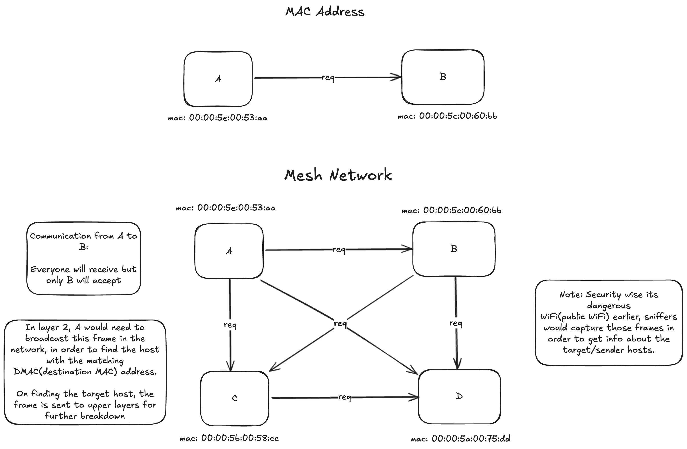
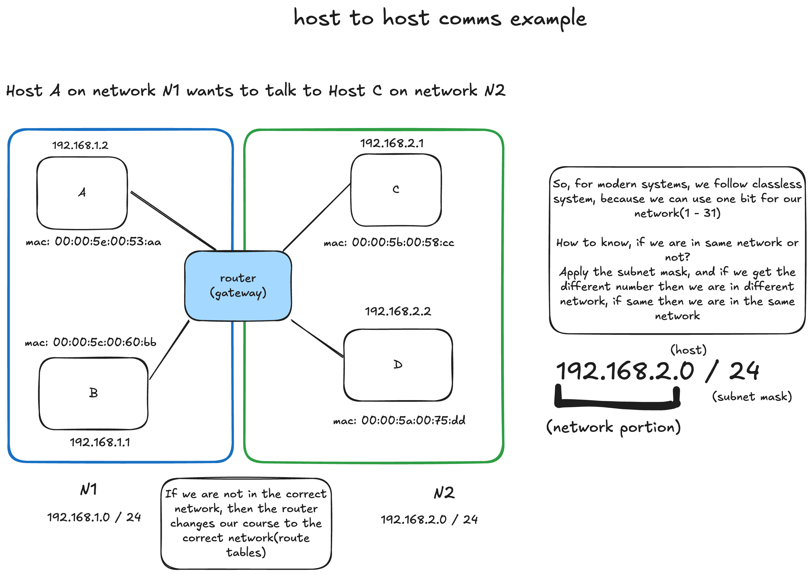

# host to host communication

**Note**: Majorly involves layers 2 and 3

## Task

* Need to send a message from host A to host B
* Usually a request to do to something on host B(RPC)
* Each network card has a unique MAC(Media Access Control) addresses

Points to be noted:

* Imagine a large number of machines?
* We need a way to eliminate the need to send it to everyone
* The address needs to get better
* We need the ability to route, meet the IP address
  (We need to slash down our search for the target machine, like indexes in DB in order to save the search reduce it down instead of going through the whole DB or whole network)

In comes the IP addresses:

* The IP addresses is built in two parts
* One part to identify the network, and other to find the host(network portion to eliminate network search, and host portion to identify hosts)
* Still needs MAC addresses

## host to host comms: example

Problem: What if our host have many apps?

* Not enough to just route to the hosts
* The hosts are running many applications with different requirements
* Ports (SSH : 22, HTTP: 80, SMTP: 25 .... on same machine)

