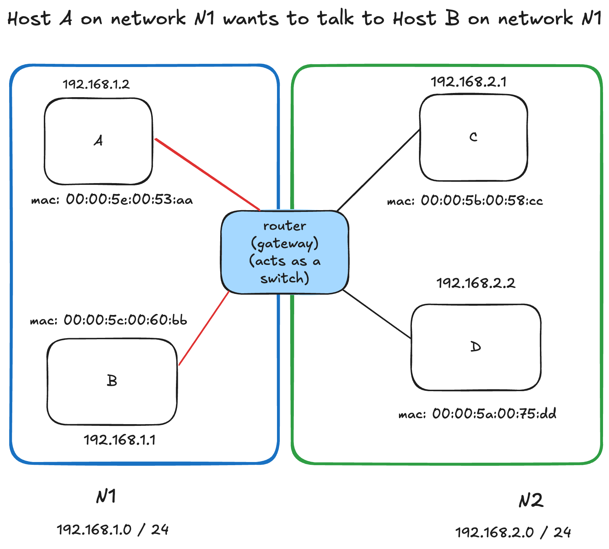
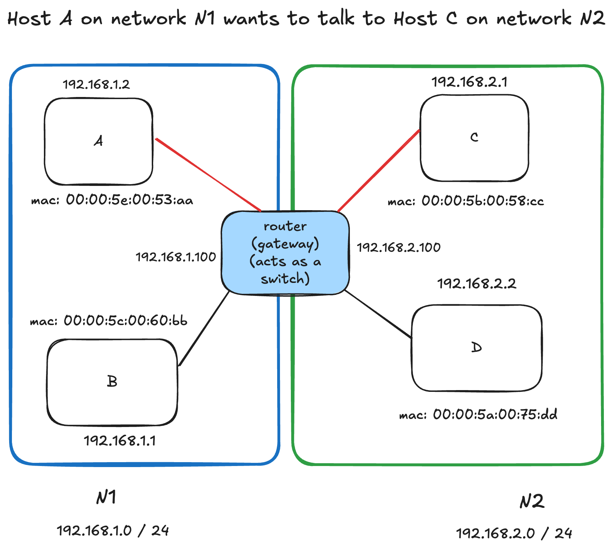

# 004 - The IP building blocks

## ip address

* Layer 3 property
* Can be set automatically(DHCP) or statically
* Network and Host partition
* 4 bytes in IPv4 - 32 bits

## network vs host

* a.b.c.d/x (a,b,c and d are integers) x is the network bits and remains are host
* example: 192.168.254.0 / 24
* The first 24 bytes (3 bytes) are networks the rest 8 are for host
* This means we can have 2^24 networks and each network has 2^8 hosts
* called a subnet

## subnet mask

* 192.168.254.0 / 24 -----> subnet
* Subnet mask ------> 255.255.255.0
* Subnet mask is used to determine whether an IP is in the same subnet
*  If the target host is in the same subnet, just use the MAC address to send the data packets
* Otherwise, we need someone to route the traffic to the target network and then to the target hosts (router or gateway)

## default gateway

* Most networks consists of hosts and a default gateway
* When host A want to talk to B directly ------> should be in same subnet
* Otherwise A sends it to someone who might know, the gateway
* The gateway has an IP address and each host should know its gateway

## example for same subnet communication

* 192.168.1.2 applies subnet mask to itself and the destination IP 192.168.1.1
* 255.255.255.0 & 192.168.1.2 = 192.168.1.0
* 255.255.255.0 & 192.168.1.1 = 192.168.1.0
* Same subnet ! No need to route (router acts as a switch)

## example for different subnet communication

* 192.168.1.2 applies subnet mask to itself and the destination IP 192.168.2.1
* 255.255.255.0 & 192.168.1.2 = 192.168.1.0
* 255.255.255.0 & 192.168.2.1 = 192.168.2.0
* Not the same subnet ! The packet is send to the default gateway 192.168.1.100

Possibilities:

DB in different subnet then BE app, then IP packets that are in the form of TCP connection request, from the BE app which are going through a router to the DB. If there is congestion, there can be delays.

Although it's not too bad, but there can be chance because of congestion, where the router's buffer will fill down. And `sql` statement, which will transmit to multiple segments will be paused in the router and might never reach the DB until few milli-seconds of delay.