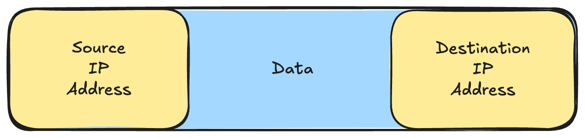
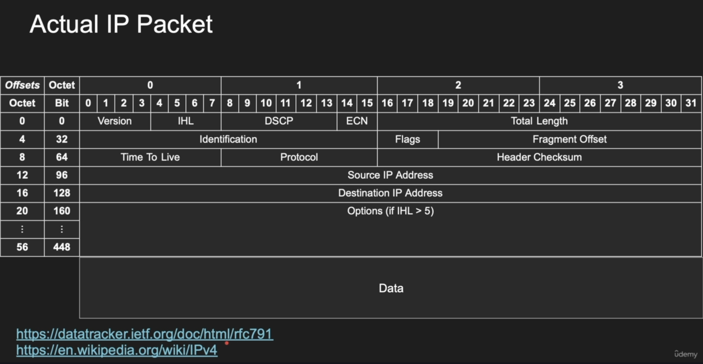
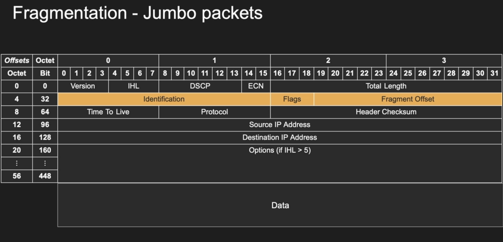

# the ip packet

## ip packet

* has headers and data sections
* ip packet header is 20 bytes (can go upto 60 bytes if options are enabled)
* data section can go upto 65536 (2^16)

We can't shove more than `1500` IP packets without fragmentation

Note: The Maximum Transmission Unit (MTU) defines the ==largest size of a data packet that can be transmitted over a network link without requiring fragmentation==.

## ip packet to a backend engineer

### Basic IP Packet:

### Actual IP Packet:

Note: In IPv4, the Internet Header Length (IHL) field ==specifies the length of the IP header in 32-bit words==. It's a 4-bit field, meaning the header length can range from a minimum of 20 bytes to a maximum of 60 bytes.

## more details on the ip packet

### version

We only use only two versions of IP (IPv4 or IPv6). 
So, that means for 4 (0 and 1) and for 6 (0, 1 and 2). Rest other go waste.

### IHL (Internet Header Length)

Defines the options length

Default : 4
If IHL > 5 (will enable options to be read by the router)

### total length

(16 bits---> 65536) ----> 2^16
20 bytes to upto 60 bytes 

### fragmentation

Most implementation are frowned upon fragmentation (QUIC disable fragmentation)

#### problem?

IP packet too large

MTU : frame size

Note: Scenario ----> Say MTU is 1500 and the IP packet size is 2000(won't fit in the frame), two options:

* Tell the client(whoever sent the packet) ---> "MTU too small, can't fit the large packet" ----> sends the message (ICMP)  (Only in the case of `disabled fragmentation` )
* Other option, fragmentation ----> 2000 = 1500(frame 1) + 500 (frame 2) ---> need not to be in order ---> then the host need to assemble the packets. 
  
  Some frames might fail, need to re-send it adds more complications. 
  
Responsibility of the client to send packet that they should know would fit into a frame.

#### identification

ID of the fragment.

#### flags

Should we fragment or not ---> true or false?

#### fragment offset

0, 1, 2, ... ---> unique identifier for the fragment

### time to live(TTL)

#### problem?

So, while routing the packet can go to different routes and they can end up in the situation when they get stuck into a endless loop.

The packet can go infinitely, and as we know `routers` are not `stateful` (IP protocol is `stateless`) 

Every IP packet has a 8 bit (1 byte) that represent a counter.

IP protocol --->  We can't do like this packet was visited before, unlike the layer 4, where we have `state` , `session` .

How do we set an expiry date to the packet? Meet TTL

So, when we send a packet, we estimate that the packet would reach the destination(host) in about say 100 routes.

So, we send it to our `gateway`(router), then it would apply `-1` to the TTL block. On the IP packet arrival, the physical layer will be getting the bytes pattern, send it to data link layer converting into `frames` , then frames would be converted into IP packets. The router takes the IP packet, decrements the TTL by one and sends it again.

Responsibility of the router: See the IP packet, decrement TTL by one and send it forward(Adding state to the IP packet)

What happens if the TTL = 0 ?

Whoever decrements it to zero, should stop and drop the packet.  The router should  send an ICMP message. 

"Packet timed out"     ---> This message should be send back to the source IP address

That's exactly how `traceroute` 👆🏻 works

`Traceroute`--> sets a very short time to live and will increment it, and every time we pass a hop, we reach the next hop, that router would tell us about its own source IP address ---> effectively we trace the entire road.

Some routers disable ICMP, or some firewalls block ICMP ---> reason for that dot dot dot in traceroute.

### protocol

Protocol is the protocol of the content inside the data. 

First, it would feel a bit useless,  because why would we need a protocol for our own data? Why are we wasting 8 bytes of information in our 64 bytes headers? 

But, it is ingeniously effective as the router would just parse the 20 bytes(4 bytes per row and 0-4 rows means 5 rows) headers , find the protocol bits (1 byte) and would know the protocol being used.

The router would know from the 255 protocols it would allow the IP packet which has the familiar IP protocol.

We have 1 byte or 8 bits ----> 255 protocols

### source and destination IP address 

IP address --> spoofing 

Spoofing ---> idea of changing the source. Every packet that we send right from our machine, we effectively change the source IP address to be something else.

Now, is it simple? Yes

But, the ISP, the packet, the IP would go through the browser, the first major router the packet would hit will be the ISP.

ISP because that's our link to the internet and it will say, my source IP address is XXXX, we can right any number here. We can code to change our source IP address, on every IP packet transmission.

But ISP, would know, how? Because ISP assigned the IP address, so the ISP would block the custom IP address. Today, every single ISP has the block to not allow spoofing. 

Unless, we build our own ISP, pay to link it to the internet.

But how will we get the responses back?? Destination IP address (critical)

Source IP address: where you're coming from (4 bytes) (32 bits)
Destination IP address: where you're going (4 bytes) (32 bits)

### explicit congestion notification

This bit is from an upper layer, it is set by the router, and it means..

Congestion : When packet start to drop

IP packets arrive at the routers like floods, packets are coming through routers, the router in order to process this, they need to send thin amount of memory (buffer) to put the packets in, and this memory fills up.

If we have too many packets or if the router is slower like it takes time to parse, more work means more time. More time means queue will go longer and the buffer will fill and if the buffer fills, that means you cannot accept more packets. It means the router would need to drop incoming packets. Any packet comes the controller of the router would need to drop the packet -----> congestion

Meaning----> the network is congested, the routers are having hard time processing and the packets stop.

Congestion control

For the longest time, routers used to simply drop the incoming packet. Just drop the packet and leave it alone, doesn't even send an ICMP message.

Client has to guess, that okay maybe it's a timeout, maybe it's because of congestion

Meet explicit congestion notification (2 bits)

The router when their buffer fills up because they are IP packets, they don't deal with layer three packets. They would take this and say I'm about to drop this.....but wait...

The router would not drop it, even though it knows that the buffer would fill, it would just set the ECN bit, boom notification. And it would process.

So now, the receiver will see that bit oh...some of the router are experiencing congestion, so now the router would tell the receiver.....so now the TCP layer takes over.....congestion.

And now the client would start communicating at the higher levels of TCP transport layer....with a small change we managed to notify both the client and server....and they just got to know about the incoming congestion without dropping any IP packets.

## summary

IP packet ---> 20 bytes (can go upto 60 bytes if IHL is enabled)
Data section ---> 65000 bytes (very large, no MTU can feed it )

Maybe AWS Cloud, Azure or GCP, built their own network with a large MTU that can effectively scale upto 65,000 bytes. 

black hole TCP connection ??

