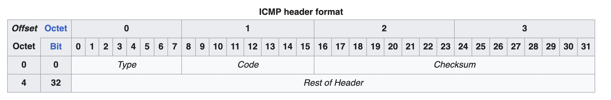
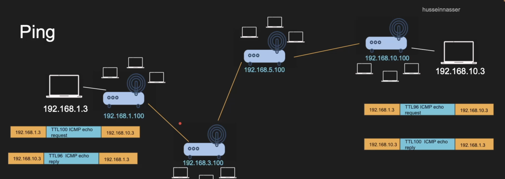
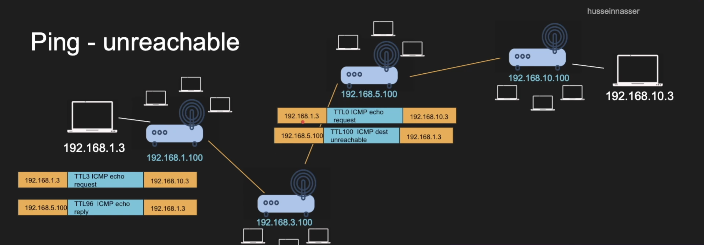
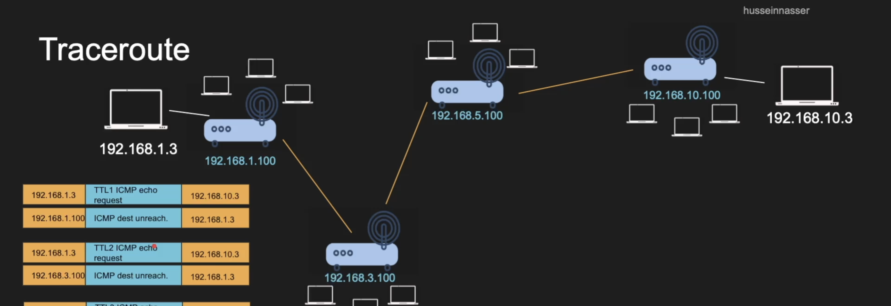
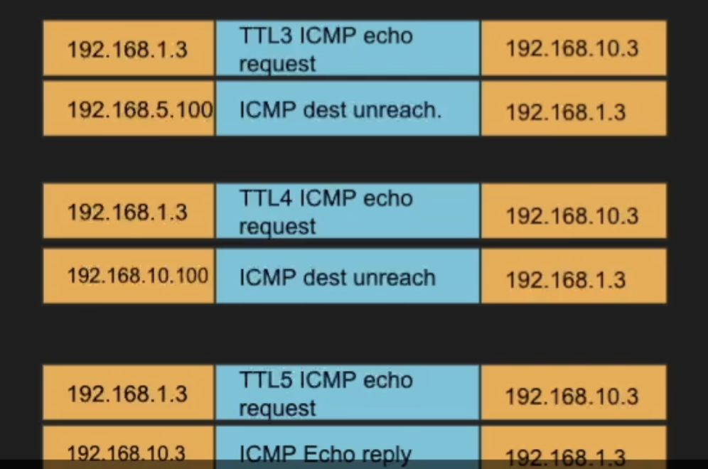

# icmp (internet control message protocol)

## icmp

* Stands for Internet control message protocol (Stays in layer 3 ---> needs only source and destination IP address)
* Designed for informational messages
	* Host unreachable, port unreachable, fragmentation needed
	* Packet expired (infinite loop in routers)
* Uses IP directly
* PING and `traceroute` use it
* Doesn't requires listeners or ports to be opened (but the host should enable ICMP ---> IP packets with the protocols set to ICMP)

* Some firewalls blocks ICMP for security reasons
* That is why PING might not work in those cases
* Disabling ICMP also can cause real damage with connection establishment (TCP Blackhole)
	* Fragmentation needed
* PING

Some firewalls block ICMP or limits ICMP or times out ICMP messages.

PING ----> IP packet with an ICMP protocol

TCP Blackhole: TCP handshake data is so tiny(SYN and SYN-ACK), but when we will start sending in real data with fragmentation turned off, and then if one of the MTU in the devices is soo small that the IP packet can't pass through then, the router would try to send an ICMP message, saying "Hey, IP packet too large to pass through, make it smaller". But, ICMP is blocked, so we won't receive the ICMP message, and it would appear to us that the TCP Connection is OPEN, but the data packets would be going into a VOID. (TCP Blackhole )

## ping

### host reachable

### host unreachable

## traceroute

* can you identify the entire path your IP packet takes?
* clever use of TTL
* Increment TTL slowly and you will get the router IP address for each hop
* Doesn't always work as path changes and ICMP might be blocked 

#### working of traceroute

