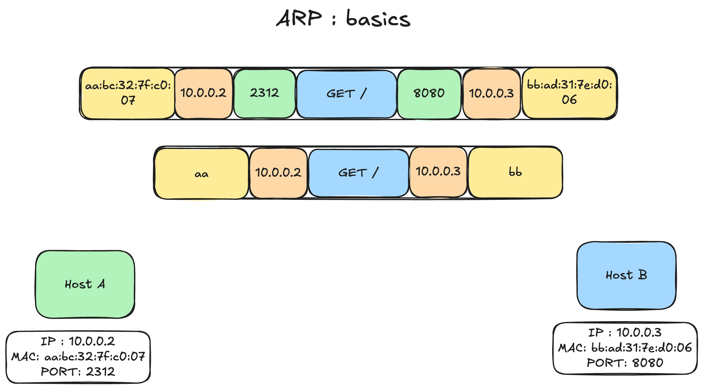
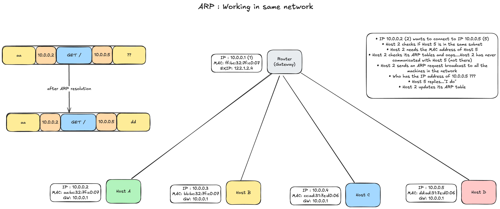
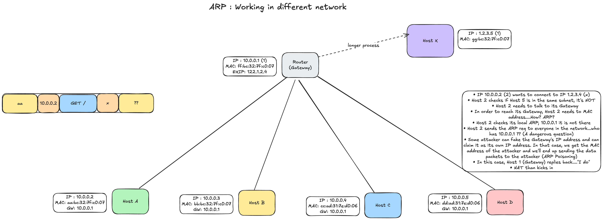

# address resolution protocol (arp)

In order to map the IP address to the MAC address ---> ARP (layer 2)

## why ARP?

* We need MAC address to send frames (layer 2)
* Most of the time we know the IP address but not the MAC
* ARP table is cached IP --> MAC addressing mapping

## arp basics

## arp in same network

## arp in different network

## summary

* ARP stands for Address resolution protocol
* We need MAC address to send frames between machines
* Almost always we have the IP address but not the MAC
* Need a lookup protocol that give us the MAC from IP address
* Attacks can be performed on ARP (ARP poisoning)

VRRP (Virtual Router Redundancy Protocol) : load balancing using a virtual IP address

ARP plays a critical role here. Say, for the same IP address we have 7 different machines, so one machine share the IP first and then it goes down and the other machine takes over the IP address. Here, the question of "What is the destination MAC?", will be answered by many machines.

### experiment

Using `tcpdump` for looking for the working of the protocols

* For `arp`: tcpdump -i -n en0 arp
* For `icmp`: tcpdump -n -i en0 icmp

