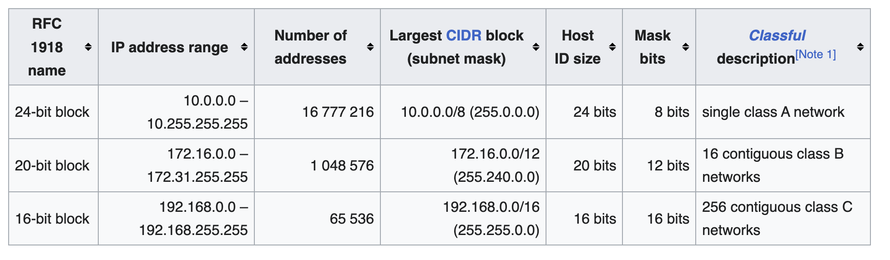

# private IP addresses

### ranges of private IP address

So, if there are detected in the public internet, they will be dropped immediately. But now when you're using a VPN, proxy solution like ZScaler
