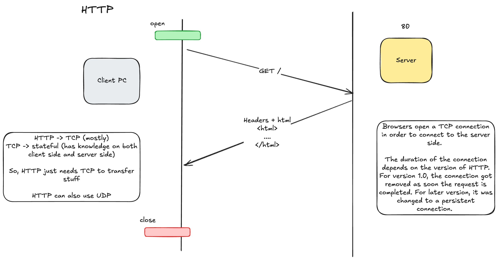
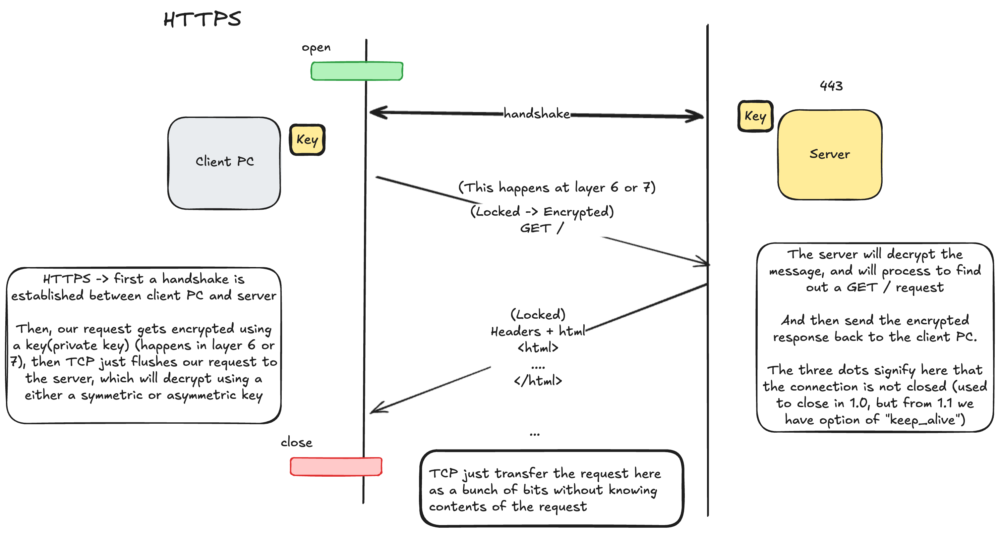
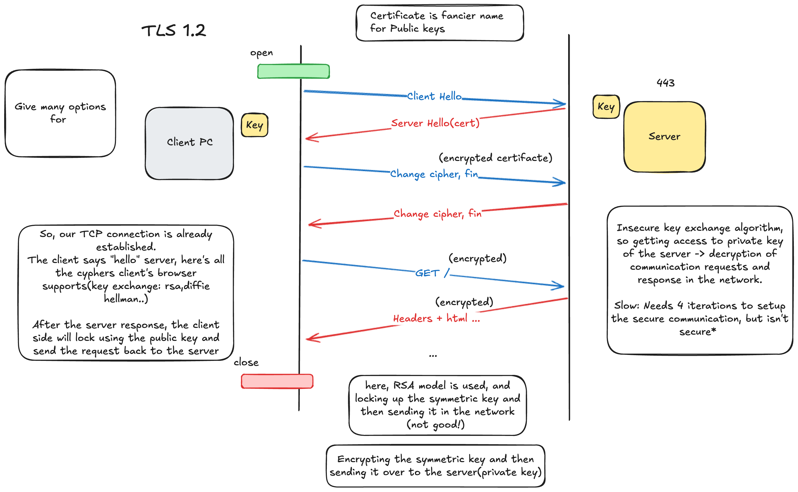
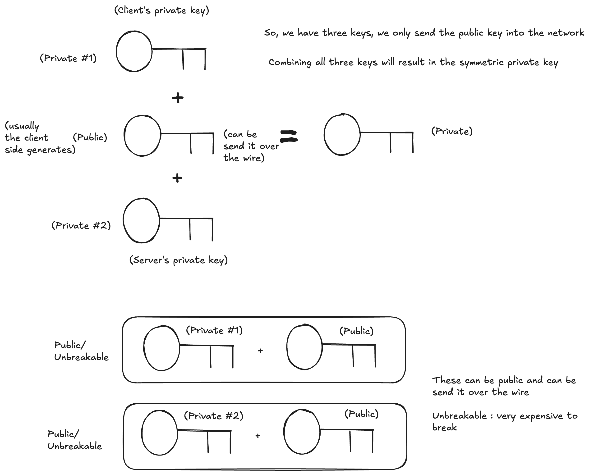
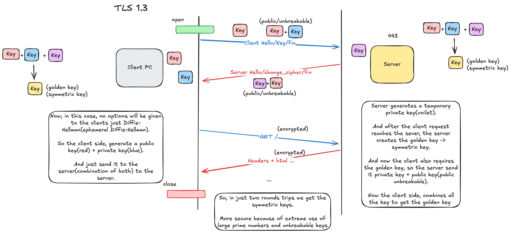

# Networking Protocols

# HTTP

# HTTPS

# Transport Layer Security(TLS)

## TLS 1.2

Note: Before learning TLS 1.3, we need to understand Diffie-Hellman Key exchange algorithm

## Diffie-Hellman Key Exchange

## TLS 1.3

