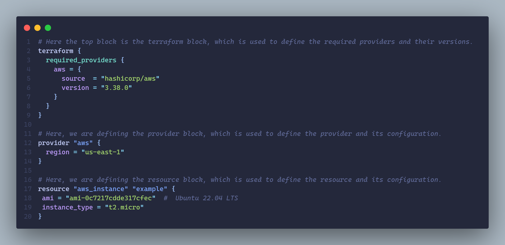

# Terraform

Terraform is a tool for building, changing and versioning infrastructure safely and efficiently.

It enables application software best practices to infrastructure. It is compatible with many clouds and services.

### Common Patterns

- Terraform + Configuration Management Tool(Ansible)
- Terraform + Server Templating
- Terraform + Orchestration Tool(K8s)

## Terraform Architecture


## Installation

For Windows:

We can use the `choco`(a windows package manager) to install `terraform` using the simple command on an terminal with administrative permissions:

```bash
choco install terraform
```

## Authenticating to a cloud provider

Now, in order to setup the infrastructure we need to connect to a cloud provider here in this case were using AWS, so let's create a IAM role for for terraform in AWS.

### Creating a group with necessary permissions along with IAM roles for User and Terraform


Creating a group named `terraform-practice` with the given set of permissions below:


Now creating the IAM roles for `user` and `terraform`


And finally, we can create the access keys for the user with the role we created.

## Installing AWS-CLI

In order to apply the terraform config to AWS, we need to configure our local system with AWS using the AWS-CLI. In order to install the AWS-CLI on windows, simply run the following command on the administrative terminal:

```bash
choco install awscli
```

Now, after installation configure the AWS-CLI by using the command:

```bash
aws configure
```

And we will be prompted to add the have the access key with its secret, required zone for the AWS service along with the output format.

In order to generate the access keys go to:

IAM roles > Users we want to have the access keys > Security Credentials > Access Keys.

## Overview

Now, since we have configured the aws-cli, then we can start with basic terraform setup for a EC2 instance.

Here's the basics terraform config file `main.tf` for having setup an EC2 instance.



In order to run the config, we need to initialize the backend for the terraform using the command in the same directory where our `main.tf` file is located:

```bash
terraform init
```

Now, our backend for terraform is initialized so, we can see the resource actions which terraform will perform in order to meet the desired state in our `main.tf` file. For that we need to run:

```bash
terraform plan
```

Finally, in order to apply the desired state, we run `terraform apply`.

Now, if we want to delete our created resources, then we can run the command`terraform destroy` .
