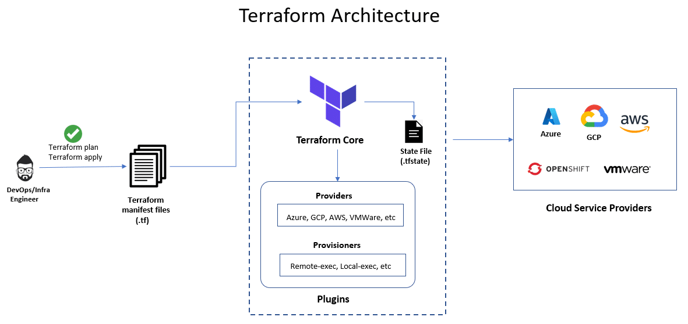
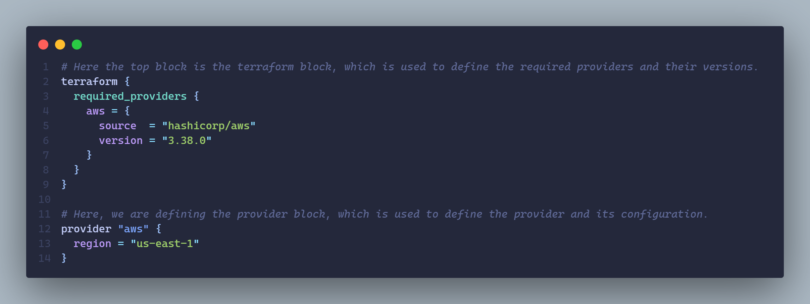

# Basic Usage Sequence

- **terraform init** : Initializes the project
- **terraform plan** : Takes the configuration and checks it the currently deployed state of the world and the state files. It figures the set of things needed to happen to provision that structure.
- **terraform apply** : Takes the set of commands and applies them, in order the achieve the desired infrastructure.
- **terraform destroy** : Cleaning down resources or eliminating the not required infrastructure.

# Architecture



# Providers




# $ terraform init


Here, in the beginning we will just have a `main.tf` file, in the directory. Now if we run the `init` command, terraform download the associated cloud provider. Now our structure would look this:


Here, we have an additional hidden directory named `.terraform`. The inside the `providers` directory we have `registry.terraform.io` directory, which is the official directory for terraform.

Now in the `aws` directory, we have `version` for the provider and inside `version` we have architecture and finally inside architecture we have final application for our cloud provider.

#### .terraform.lock.hcl

It contains details about specific dependencies and providers that are installed within the workspace

#### Modules

Module is a way to bundle up code for increase the reusability. If we are using any modules then terraform will go and download the modules into our workspace.

Inside the `.terraform` directory we can have a sibling folder for `modules` which would have all the configuration needed with those modules.

## State File

- Terraform's representation of the word
- JSON file containing information about about every resource and data object
- Contains sensitive information
- Can be stored locally or remotely

## Local Backend


Local Backend for terraform, which contains local setup, individual and terraform state files. Some points regarding local backend:

- Simple to get started!
- Sensitive values in plain text
- Uncollaborative
- Manual

## Remote Backend


Now, in case of remote backend, we can separate the individual developer and have the terraform setup along with its state files on a remote server. One option is having _terraform cloud_ which manages the state files and permissions, or we can self manages the remote backend by using _Amazon S3 bucket_. Some points regarding remote backend:

- Sensitive data encrypted
- Collaboration possible
- Automation possible
- Increased complexity

# $ terraform plan


The plan command checks out the _terraform config (desired state)_ and _terraform state (actual state)_ and if there are any dissimilarities in the desired state so the changes are needed to be applied.

# $ terraform apply


As the changes we find in the terraform plan command, we can then apply those changes from the desired state to the actual state.

# $ terraform destroy


With the help of this command, we destroy the infrastructure we have specified in the terraform state files.

## Remote Backend(Terraform Cloud)

```json
terraform{
	backend "remote" {
		organization = "devops-directive"

		workspaces {
			name = "terraform-course"
		}
	}
}
```

## Remote Backend(AWS)

```json
terraform {
	backend "s3" {
		bucket         = "terraform-practice"
		key            = "tf-infra/terraform.tfstate"
		region         = "us-east-1"
		dynamodb_table = "terraform-state-locking"
		encrypt        = true
	}
}
```

- S3 bucket used for storage
- DynamoDB used for locking

### Remote Backend : Bootstrapping Part 1

```json
terraform {
  required_providers {
    aws = {
        source = "hashicorp/aws"
        version = "~> 3.0"
    }
  }
}

provider "aws" {
  region = "us-east-1"
}

resource "aws_s3_bucket" "terraform_state" {
    bucket = "terraform-practice"
    force_destroy = true
    versioning {
      enabled = true
    }

    server_side_encryption_configuration {
      rule {
        apply_server_side_encryption_by_default {
          sse_algorithm = "AES256"
        }
      }
    }
}

resource "aws_dynamodb_table" "terraform_locks" {
    name = "terraform-state-locking"
    billing_mode = "PAY_PER_REQUEST"
    hash_key = "LockID"
    attribute {
      name = "LockID"
      type = "S"
    }
}
```

### Remote Backend : Bootstrapping Part 2

```json
terraform {
  backend "s3" {
    bucket = "terraform-practice"
    key = "tf-infra/terraform.tfstate"
    region = "us-east-1"
    dynamodb_table = "terraform-practice-lock"
    encrypt = true
  }

  required_providers {
    aws = {
      source  = "hashicorp/aws"
      version = "3.38.0"
    }
  }
}

provider "aws" {
  region = "us-east-1"
}

resource "aws_s3_bucket" "terraform_state" {
    bucket = "terraform-practice"
    force_destroy = true
    versioning {
      enabled = true
    }
}
```

## A few important points about Terraform syntax

- _resource_ block is used to specify the configuration of the required resources
- _data_ block on the other hand, is used to reference an existing resource.
