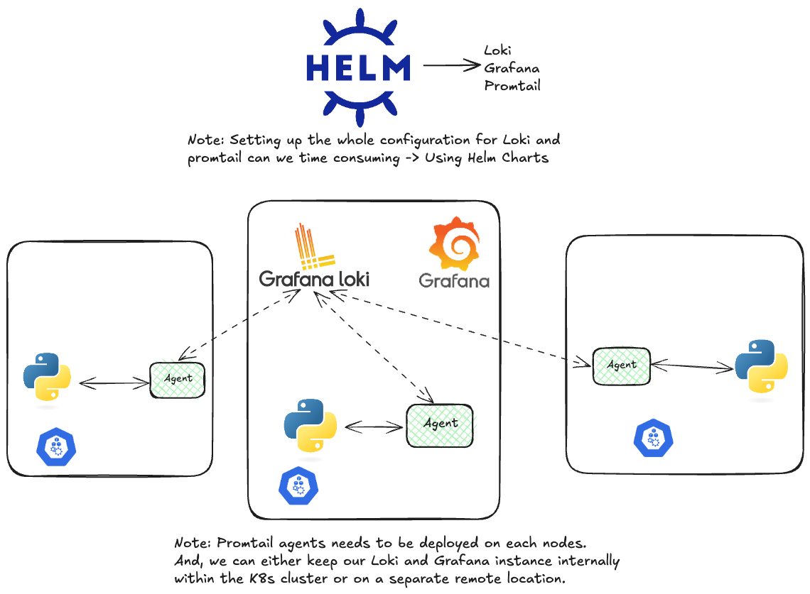

# Loki in Kubernetes



## Installing Helm

Using homebrew, we can install `helm`, with the following command:

```zsh
brew install helm
```

## Adding Grafana repo to Helm

In order to add `grafana` repo in order to utilize the grafana helm charts, we can use the following command:

```zsh
helm repo add grafana https://grafana.github.io/helm-charts
```

In order to update Helm repos, use:

```zsh
helm repo update
```

## Installing Loki using helm on k8s

Now, to install `loki` we need to first search for it in the configured `grafana` repo, use:

```zsh
helm search repo loki
```

For configuring, our `loki stack` -> grafana + loki + promtail, we need to go with the `loki stack` helm chart

#### Note:

In order to deeply understand, Loki stack config, we need to store the `values` from the helm chart into yaml syntax file `values.yaml`.

```zsh
helm show values grafana/loki-stack > values.yaml 
```

After modifying the attributes of our `loki-stack` from the `values.yaml`, we can simply install the helm chart.

#### Installing helm chart

We can install the helm chart , by using the following command:

```zsh
helm install --values values.yaml loki grafana/loki-stack
```

Now, we can see all of the stuff installed by the helm chart, by using:

```zsh
kubectl get all
```

##### Note:

After running the `kubectl get all` command, we can see many k8s objects:

- Deployments and replicasets: Responsible for the pods
- Daemonset: Making sure that the promtail agent gets installed in every node

## Grafana on k8s

In order to see the `grafana` GUI, as our pods are also using the `cluster-ip`, so we can `port forward` to `3000:3000` , we can use this command:

```zsh
kubectl port-forward <grafana-pod-name> 3000:3000
```

Now, in order to access the grafana dashboard, we need the credentails to log in, and we can fetch that using `secrets` object in k8s.

In order to get all secretes, we use:

```zsh
kubectl get secrets
```

Now, we can use jsonpath to get our grafana admin password, which will be `base64` encoded, using this command:

```zsh
kubectl get secrets loki-grafana -o jsonpath="{.data.admin-password}" | base64 --decode
```

## Promtail configs

We have take a look at the `promtail` configs by running the command:

```zsh
kubectl describe pod <pod-name>
```

We can see the `promtail configs` are coming from a volume which itself comes from a secret.

In order to see the secret, we simply run the command:

```zsh
kubectl get secret
```

We can obtain the name of the our required secret. We can also describe a secret using the following command:

```zsh
kubectl describe secret <secret-name>
```

We can see the config is stored in a `promtail.yaml` file, and we can use the `jsonpath` along with the `-o` flag in order to see the details of the config file. But wait, the contents will be `base64` encoded so in order to decode it we can simply run following command:

```zsh
kubectl get secret loki-promtail -o jsonpath="{.data.promtail\.yaml}" | base64 --decode
```

#### Note:

We can see under the `clients` flag, our loki's api endpoint, where our logs are getting pushed. `Loki` being a `log aggregator` collects all the logs, which can we configured along with Grafana to visualize the logs.

Under the `scrape_configs`, we can see the labels defined which we can see in the Grafana dashboard as well.

Now, let's generate some logs using a dummy server, so for that we will be creating a `deployment` using this manifest file:

```yaml
---
apiVersion: apps/v1
kind: Deployment
metadata:
  name: api

spec:
  selector:
    matchLabels:
      app: api

  template:
    metadata:
      labels:
        app: api

    spec:
      containers:
        - name: api
          image: kodekloud/loki-demo
          resources:
            limits:
              memory: 128Mi
              cpu: 500m
```

This deployment will just create logs, the setup is preconfigured to push logs in `loki`, which will be visualized in Grafana.
