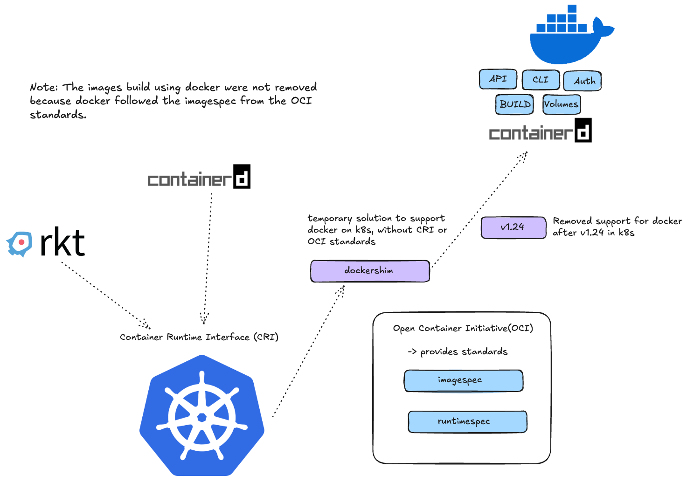
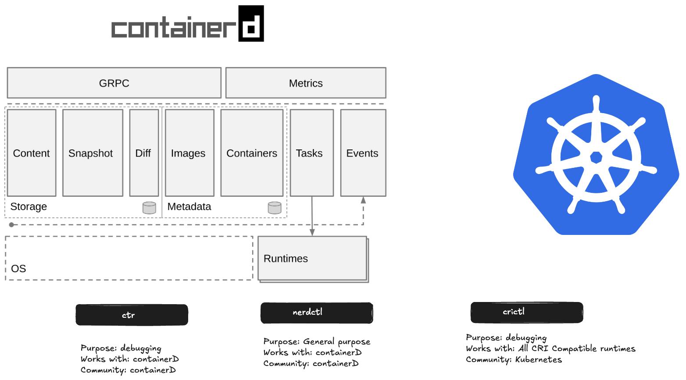

In the containers race, there were many tools or platforms which helps to run containers. But the UX of Docker was more appealing for the developers. So, Docker was the defacto tool for running containers or containerizing applications. 

Later come kubernetes, which was closely knitted with Docker. As k8s grew in popularity, a demand for using other containerizing platforms also came, so k8s team decided to intro a CRI (Container Runtime Interface) which only allows containerizing platform as container runtime which supported OCI (Open Container Initiative) standards.



### OCI (Open Container Initiative)

#### Imagespec

Specifications on how an image should be build

#### Runtimespec

It defines the standard on how any container runtime should be developed.

### Docker on k8s

Since, docker was not compliant with the OCI standards, so in order to use docker withh k8s, another API was developed named `dockershim`. dockershim was used to by-pass the CRI checks.

Under the hood in docker, it had multiple components, API, Auth, Build, Volumes, containerd, etc. The only component which was OCI compliant was `containerd`, which was later used as a container runtime directly. The need to support docker felt unnecessary as `containerd` could be maintained without additional efforts.

Later with k8s `v1.24`, docker support was removed from k8s.

Note: The images build using docker were not removed because docker followed the imagespec from the OCI standards.

## Containerd



For the Installation of containerd, follow the guide [here](https://github.com/containerd/containerd/blob/main/docs/getting-started.md).

By default, containerd comes with a CLI, named `ctr`, not user friendly, only used for debugging purposes and support only limited features.

`nerdctl` , another tool provides a stable and human-friendly user experience.

### Working with containerd

Let's say we want to pull an image using the `ctr` tool. We can do that by using the command:

```zsh
ctr images pull docker.io/library/redis:apline
```

To run the container

```zsh
ctr run docker.io/library/redis:apline
```

### nerdctl

* nertctl provides a docker-like CLI for containerD
* nertctl supports docker compose
* nerdctl supports newer features in containerD
	* Encrypted container images
	* Lazy Pulling
	* P2P image distribution
	* Image signing and verifying
	* Namespaces in k8s

### crictl

* `crictl` provides a CLI for CRI compatible container runtimes
* Installed separately
* Used to inspect and debug container runtimes
	* Not to create container ideally.
* Works across different runtimes.

Some basic commands of `crictl`:

```zsh
crictl

crictl pull redis

crictl images

crictl ps -a

crictl exec -it -t 3e ls

crictl logs 3e

crictl pods
```

