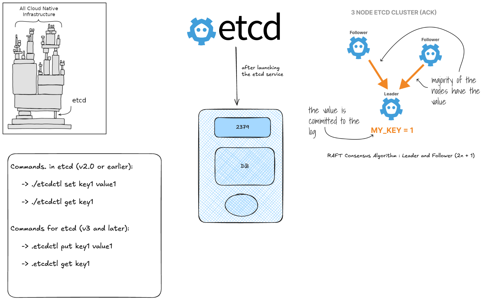
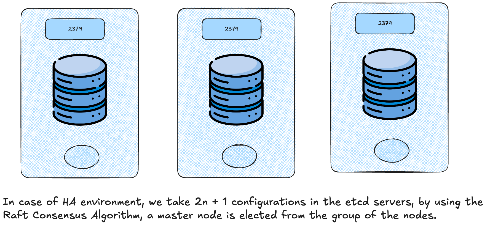

We can always keep our data, in a more efficient way using a key value pairs instead of managing the data in a tabular format.

`etcd` is a distributed reliable key-value store for the most critical data of a distributed system, with a focus on being:

- _Simple_: well-defined, user-facing API (gRPC)
- _Secure_: automatic TLS with optional client cert authentication
- _Fast_: benchmarked 10,000 writes/sec
- _Reliable_: properly distributed using Raft



## Installation

* Download the binaries from [here](https://github.com/etcd-io/etcd/releases)
* Extract
* Run the etcd service

## etcd in k8s

So, the `ectd` is responsible to store of the `kubectl get` command, be it:

* Nodes
* Pods
* Configs
* Secrets
* Accounts
* Roles
* Bindings
* Others

Even every change in the k8s cluster is saved in the `etcd` server. Only once it is updated in the `etcd` server, is the change considered to be complete.

#### Setup in etcd

##### Manual setup

The `etcd` cluster is setup using the binaries. `etcd` listens on the `advertise-client-urls`, it happens to be on the `IP` of the server, and port `2379` (default port of the server). 
This URL should be configured on the `kube-api-server`, when it tries to reach the `etcd` cluster.

#### kubeadm setup

We can deploy `ectd` as a pod.

```bash
kubectl get pods -n kube-system

kubectl exec etcd-master -n kube-system etcdctl get / --prefix -keys-
```

The root directory is a `registry` which contains many constructs like `minions`, `replicasets`, `deployments`, `pods`, `roles`, `secrets`, etc.

#### etcd in HA environments



#### etcd commands

ETCDCTL is the CLI tool used to interact with ETCD.ETCDCTL can interact with ETCD Server using 2 API versions – Version 2 and Version 3. By default it’s set to use Version 2. Each version has different sets of commands.

For example, ETCDCTL version 2 supports the following commands:

```
etcdctl backup
etcdctl cluster-health
etcdctl mk
etcdctl mkdir
etcdctl set
```

Whereas the commands are different in version 3

```
etcdctl snapshot save
etcdctl endpoint health
etcdctl get
etcdctl put
```

To set the right version of API set the environment variable ETCDCTL_API command

```
export ETCDCTL_API=3
```

When the API version is not set, it is assumed to be set to version 2. And version 3 commands listed above don’t work. When API version is set to version 3, version 2 commands listed above don’t work.

Apart from that, you must also specify the path to certificate files so that ETCDCTL can authenticate to the ETCD API Server. The certificate files are available in the etcd-master at the following path. We discuss more about certificates in the security section of this course. So don’t worry if this looks complex:

```
--cacert /etc/kubernetes/pki/etcd/ca.crt
--cert /etc/kubernetes/pki/etcd/server.crt
--key /etc/kubernetes/pki/etcd/server.key
```

So for the commands, I showed in the previous video to work you must specify the ETCDCTL API version and path to certificate files. Below is the final form:

```
kubectl exec etcd-controlplane -n kube-system -- sh -c "ETCDCTL_API=3 etcdctl get / \
  --prefix --keys-only --limit=10 / \
  --cacert /etc/kubernetes/pki/etcd/ca.crt \
  --cert /etc/kubernetes/pki/etcd/server.crt \
  --key /etc/kubernetes/pki/etcd/server.key"
```