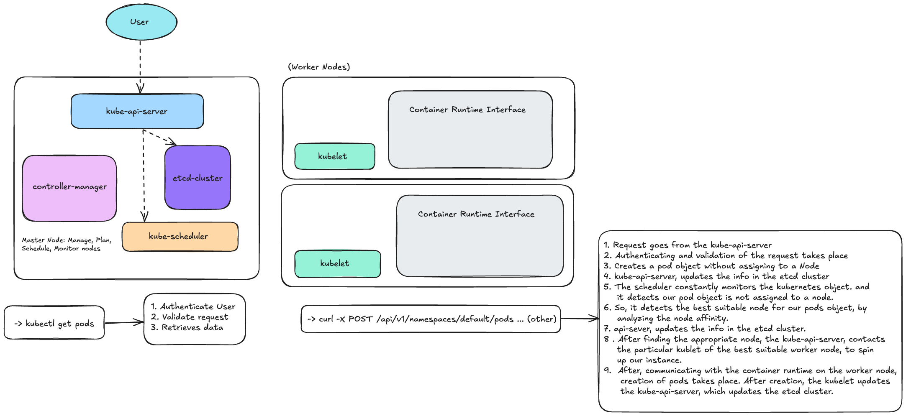
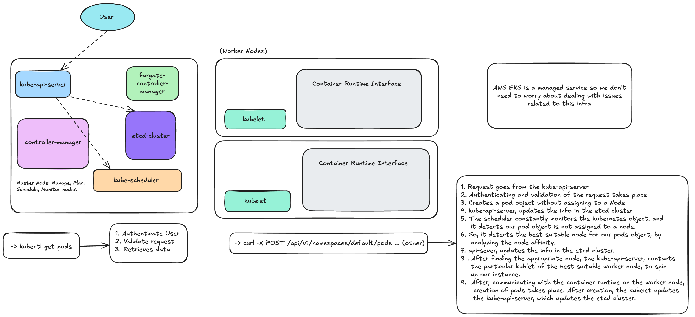

# k8s-intro

Kubernetes : portable, extensive, oss platform for managing container workloads.

#### Out of box features

- Service discovery and load balancing
- Storage orchestration
- Automated rollouts and rollbacks
- Automatic bin packaging
- Self-Healing
- Secret and configuration management

# Architecutre

## Master Node

### kube-api-server

- brain of the k8s
- Usually, any of the CLI tools talks with the api-server
- intermediary, in the interaction of k8s components

### etcd

- Consistent, HA `key-value store` used as k8s's backing store for all cluster data.
- Stores all nodes data

### kube-scheduler

- Smartest component of k8s
- Responsible for distributing containers across multiple nodes.
- Watches for newly created pods with no assigned node, and selects a node for them to run on (node_affinity).

### kube-controller-manager

- Controllers are responsible for noticing and responding why nodes, containers or endpoints go down. Makes decisions to bring up new containers in such cases.
- Maintains `ideal state = desired state`
- Node controller: Responsible for noticing and responding when nodes go down.
- Replication controller: Responsible for maintaining the correct number of pods for every replication controller object in the system.
- Endpoints controller: Populates the endpoints object(i.e joins Services & Pods).
- Service Account & Token controller: Creates default accounts and API access for new namespaces.

### cloud-controller-manager

- Embeds cloud-specific control logic.
- Runs controllers that are specific to the cloud provider.
- On-premise ❌
- Node controller: For checking up on the node i.e. EC2(managed) or Fargate(if serverless).
- Route controller: For setting up routes in the cloud infra.
- Service controller: For creating, updating and deleting cloud provider load balancer.

## Worker Node

### container runtime

### kubelet

- Agent that runs on every node in the cluster.
- Responsible for making sure that containers are running in a pod inside the node.

### kube-proxy

- Network proxy which maintains network rules on nodes.
- Network rules allows network communication to the pods from network sessions inside and outside of the k8s cluster.

# EKS Architecture

