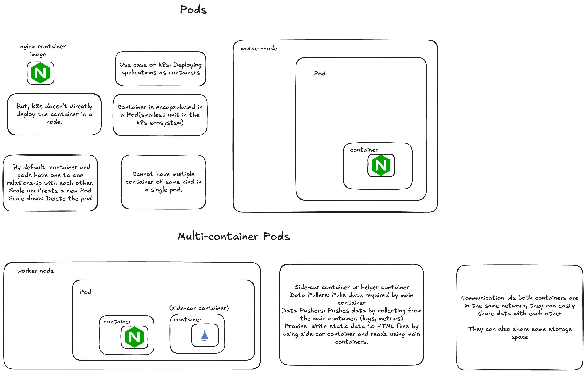

# Pods



## pods-demo

### running a pod

```zsh
kubectl run <desired-pod-name> --image <container-image>
```

OR

```zsh
k run <desired-pod-name> --image <container-image>
```

### listing pods

```zsh
k get pods
```

OR

```zsh
kubectl get po
```

For more better information

```zsh
k get po -n <namespace-except-default-if-any> -o wide
```

### describing pod info

Note: Helps us in troubleshooting in case `crashback-loop-failures` or other scenarios

```zsh
k describe pod <pod-name>
```

### deleting pod

```zsh
k delete pod -n <namespace-if-any> <pod-name>
```

Note: Now, we want to access our `nginx` container/pod. By default, we will not be able to do that because of `k8s` internal network preventing outside traffic. So, for that case, we need to create a service
