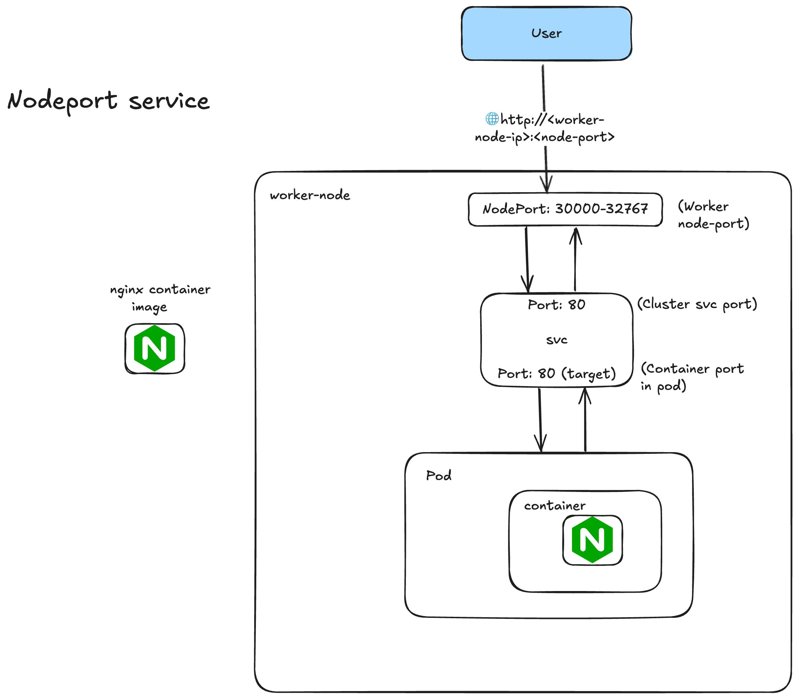

# Services

Exposing an application running on a set of `pods` using different kinds of services:

- node-port
- clusterIPs
- loadbalancer

## nodeport service



To access our application outside of k8s cluster. Exposes the service on each `worker node's IP` at a `static port`(nodeport).

Note: A `clusterIP` service, to which the nodeport service routes, is automatically created. Port range: `30000 - 32767`. If using declarative way, we can provide any port from the given range to be considered as a nodeport.

### nodeport demo

```zsh
k expose pod -n <namespace-if-any> <pod-name> --type=NodePort --port=<cluster-svc-port> --target-port=<container-port-in-pod> --name=<svc-name-you-wanna-give>
```

Note: If we don't provide the `target-port`, by default the same port will be mapped as we have defined in our `port`.

In order to get the services

```zsh
k get svc -n <namespace>
```

Now, let's get the `public IP` of our `worker nodes`.

```zsh
k get nodes -o wide
```

Note: Since in `kind` or many local `k8s` setups, we don't get the `external-IP` for our nodes, for that there's a small hack:

```zsh
k port-forward -n dev service/<service-name> <local-port>:<svc-port>
```

Here, `local-port` is the port where we want to port forward the `svc-port` traffic.

Note: In actual `EKS`, even if say our `nginx` application is running in a pod inside of a `worker-node-A`, and our `svc` is defined, but still using the `worker-node-B`'s IP, we will be able to access our application.
Reason being the service is across the worker-nodes, so the `svc` will still access and reaches the correct path of our application.

### interact with pods

```zsh
k logs -n <namespace> <pod-name>
```

In order to stream, pods logs

```zsh
k logs -n <namespace> <pod-name> -f
```

Now, to `exec` into the pod, we can use:

```zsh
k exec -it <pod-name> -- <shell>
```

Example:

```zsh
k exec -it nginx -- /bin/bash
```

Example commands:

```zsh
ls
cd /usr/share/nginx/html
cat index.html
exit
```

In order to run just a specific command:

```
k exec -it -n <namespace> <pod-name> <command>
```

Note: In order to get the `yaml` based file, so we run:

```zsh
k get svc -n <namespace> <svc-name> -o yaml
```
