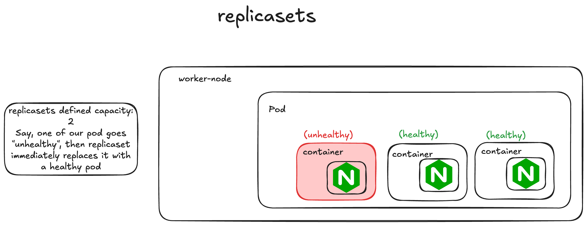
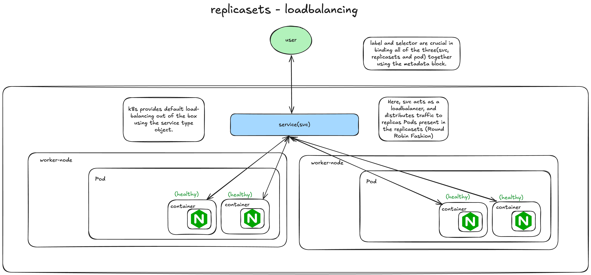
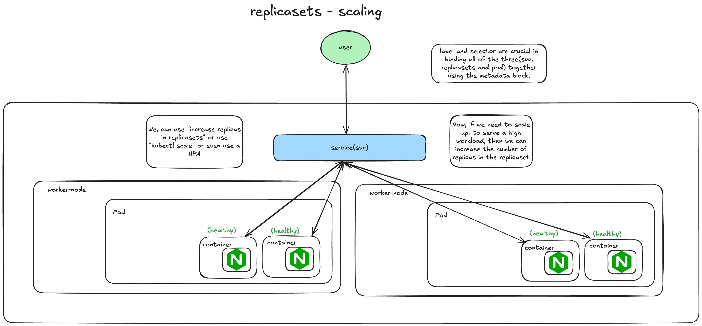

# Replicasets

Purpose: Maintain a stable set of replicas Pods running at any instance of time.

Ensures: HA or Reliability

Ex: If says we have defined the no. of replicas to be 5, and one of them dies or fails to start, then the replicasets comes into action and has to create a replacement for the failing pods(happens immediately)

## Loadbalancing

## Scaling

## demo

Replica-sets can only be created using an declarative manner(using YAML manifests).

