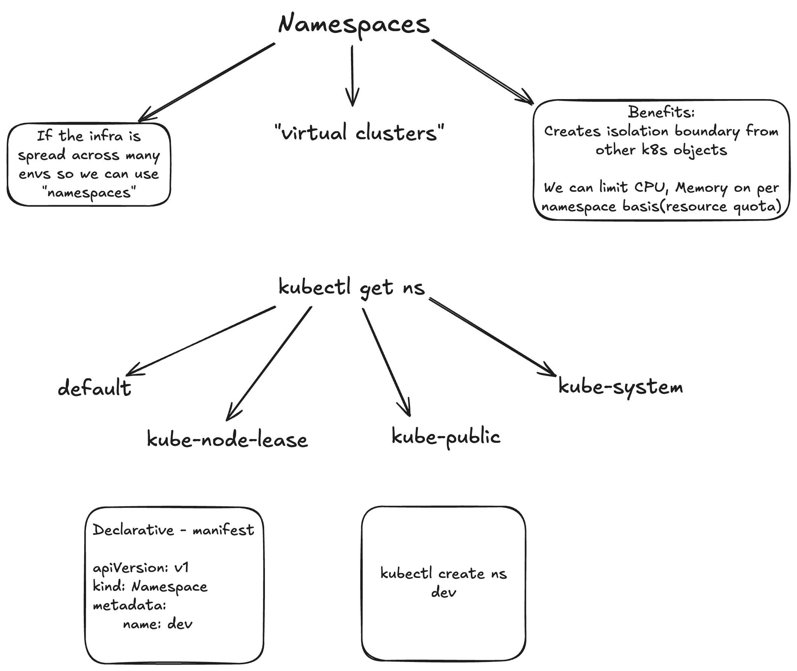

Note: If we are using `NodePort`type service for our application with an assigned(hard coded) port, in multiple namespaces then it will fail , as a `Node` has a single port, example port chosen for NodePort is 31241, so it will be used for a single use case.

Note: PVC are namespace bound ; PV are independent of namespaces


## Limits 

For restricting the resources(CPU and Memory) within a namespace to be applied to all pods

## Resource Quota

For restricting the resources(CPU and Memory), k8s objects within a namespace

```yaml
apiVersion: v1
kind: Namespace
metadata:
  name: dev1

---
apiVersion: v1
kind: LimitRange
metadata:
  name: default-cpu-mem-limit-range
  namespace: dev1
spec:
  limits:
    # default == "limit"
    - default:
        cpu: 500m
        memory: 256Mi
    # defaultRequest == "request"
      defaultRequest:
        cpu: 250m
        memory: 128Mi
      type: Container


# Add the namespace in every manifest, except storage class as its independent

---

apiVersion: v1
kind: ResourceQuota
metadata:
  name: ns-resource-quota
  namespace: dev1
spec:
  hard:
    requests.cpu: "1"
    requests.memory: "1Gi"
    limits.cpu: "2"
    limits.memory: "2Gi"
    pods: "10"
    configmaps: "10"
    persistentvolumeclaims: "5"
    secrets: "10"
    services: "10"

```


```shell
kubectl get limits -n <namespace>

kubectl describe limits <limits-name> -n <namespace>

kubectl get quota -n <namespace>

kubectl describe quota <quota-name> -n <namespace>
```

```shell

kubectl get svc -n <namespace>

kubectl get nodes -o wide
```